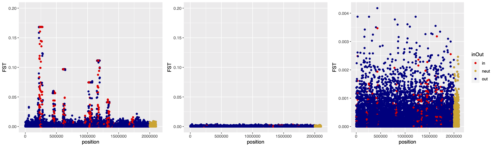

## FST values of QTNs

We want to explore what the FST values are for QTNs found inside inversions vs. outside inversions. In the following plot the first panel is for the simulation with selection occuring. Blue represents QTNs outside inversions, red represents QTNs inside inversions, and yellow represents the neutral QTNs. This is the set of sims without the inversion window implemented. I wanted to visualize both because I am struggling to wrap my head around how this influences the results.

Questions:
Brief moment of panic when I saw so many with the same FST values, but this is correct because those are the QTNs that are capture initially by the inversion and all the others are gained through time and have slightly lower FST values. Does that make sense?
Why don't we see any inversions being outliers that are neutral? I expected to see some being outliers.

TO ADD INVERSION WINDOW COMPARISON: RUNNING NOW DOUBLES THE SIMULATION RUN TIME UGHH. TIMED OUT OVER NIGHT LAST NIGHT.