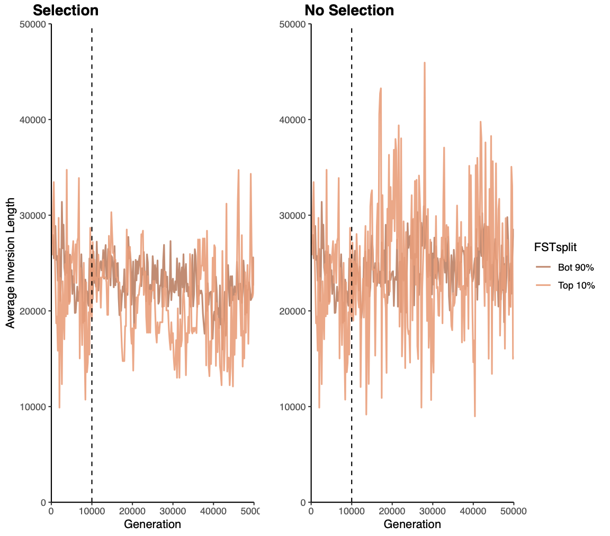

# Compare same parameters between a high and low migration rate

## Local adaptation

Notes:   

## phenotype selection

Notes:   

## Fitness

Notes:  

## Inversion Age

Notes: 

## Inversion Length

Notes: 

## Inversion QTN num

Notes: 

## Inversion QTN num length scaled

Notes: 

## Manhattan Plot

Notes: 

## Effect of Inv QTNs on Phenotypes

