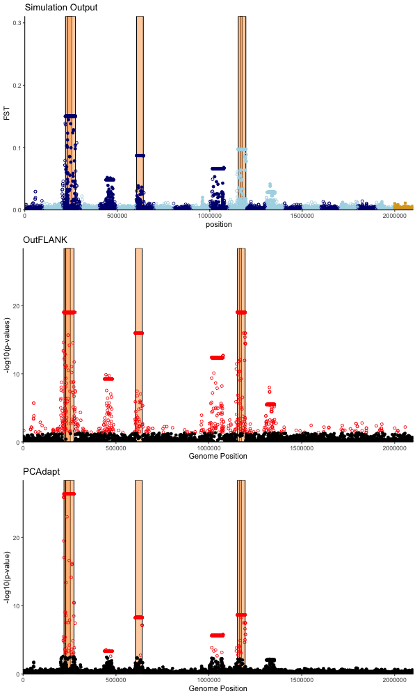

# Current Version of Figures
Each figure includes a description and the size and type of file to make sure this is what we want 

## Local Adaptation
PDF that is 67KB  
  

## Phenotypes
PDF that is 21KB  
 

> _Make one line dotted so it works in B&W_

## Fitnesses
PDF that is 21KB  
 

> _Make one line dotted to be consistent with last graph_

## Inversion Age  
PDF that is 15KB    
  

> _Make the black lines dotted so it works in B&W on this and similar line graphs_

PDF that is 6KB  
  

## Inversion Length
PDF that is 15KB  
 

PDF that is 5KB  
  

> _legend is redundant on this and other similar boxplots_

## Inversion num QTNs
PDF that is 15KB  
  

PDF that is 5KB  
  

## Manhattan 
PNG that is 48KB    
  

> _can you make this graph a bit wider so it stretches out a bit, and add arrows or grey panels in the background to indicate which inversions are adaptive? Also, change the shape of the points so it works in B&W - it may be hard to see if you use solid shapes, outlined shapes might work better_

## Inversion Origin 
PDF that is 32 KB  
  

## Heatmaps
PDF that is 1.6-1.9 MB  
  
  
  
  

## Adaptive Inversion Criteria  
PDF that is 7KB  

## Outlier detection  
PDF that is 1.7MB  
PNG that is 102 KB
  
  
> _Can you output this as a jpeg, and think about a way to present it that highlights the adaptive inversions (e.g. grey panel in background) and is compatible with B&W_

## Diagnostic plots
  
  
  
  

