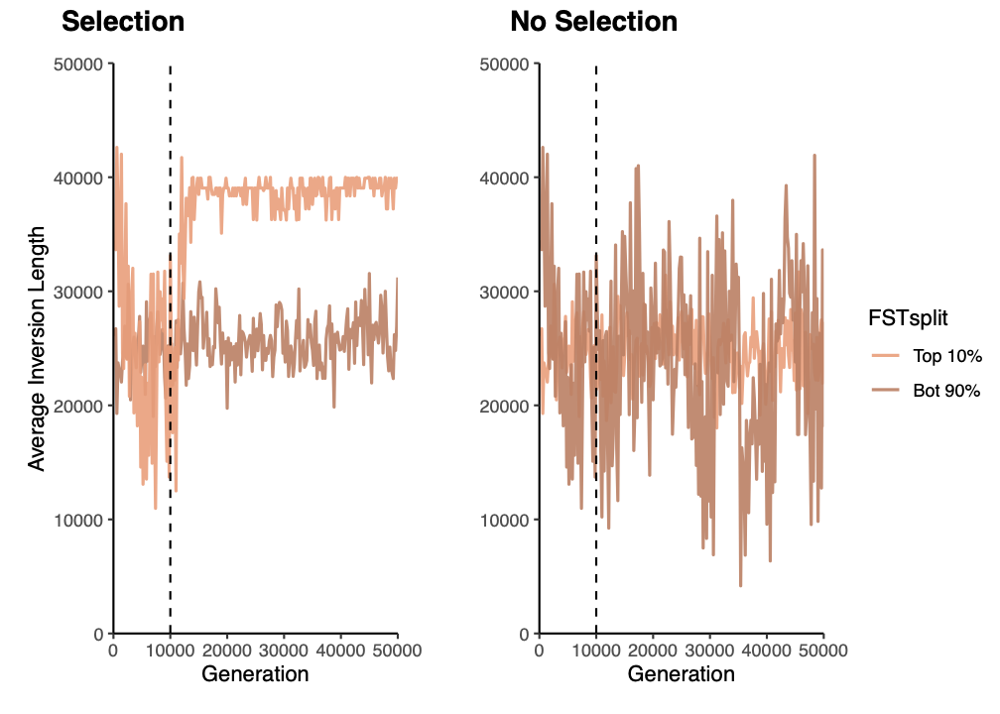
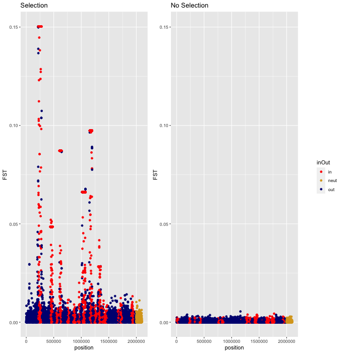

# Current Version of Figures
Each figure includes a description and the size and type of file to make sure this is what we want 

## Local Adaptation
PDF that is 67KB  
  

## Phenotypes
PDF that is 21KB  
 

## Fitnesses
PDF that is 21KB  
 

## Inversion Age  
PDF that is 15KB    
  
  
  

PDF that is 6KB  
  

## Inversion Length
PDF that is 15KB  
 
  

PDF that is 5KB  
  

## Inversion num QTNs
PDF that is 15KB  
 
  

  

## Manhattan 
PNG that is 48KB  
PDF that is 890KB  
  
  

## Inversion Origin 
PDF that is 30 KB  
  

## Heatmaps
PDF that is 1.6-1.9 MB  
  
  
  
  
## Adaptive Inversion Criteria  
PDF that is 7KB  

## Outlier detection  
PDF that is 1.7MB  

