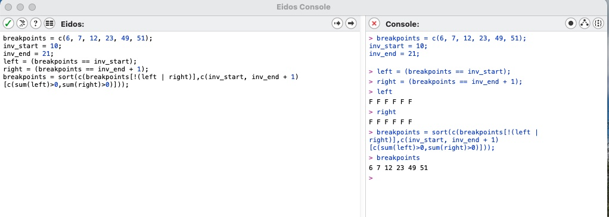
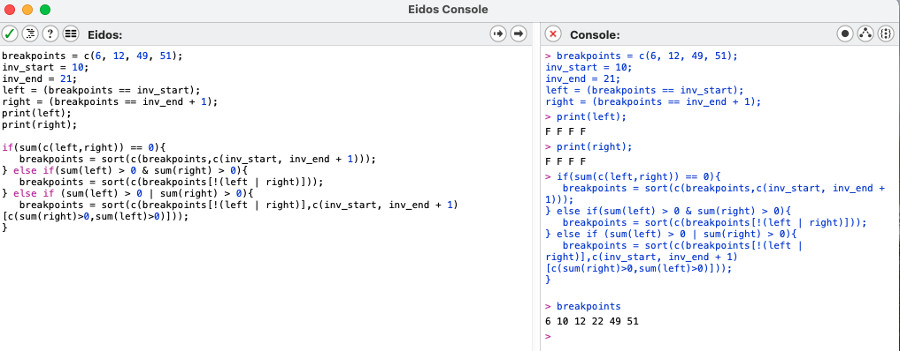
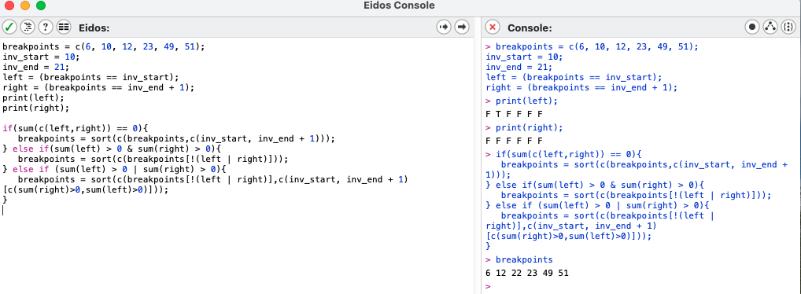
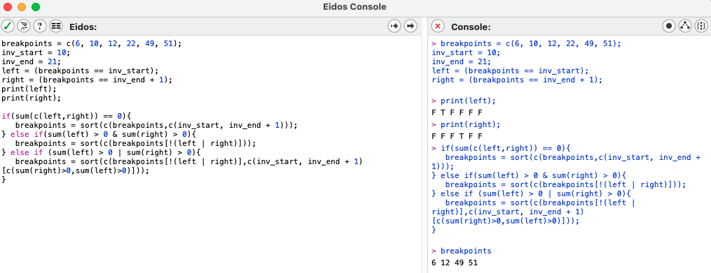

## Example of what we want slim to do when we have an inversion at [X,Y]   
In this example, D is at Y + 1 and A is at X - 1 in the standard orientation and C is some locus in the middle of the inversion just as an example locus to follow: 
```	
	AX--C----YD standard

	AY----C--XD inverted
```

Homozygote Inverted (* is proposed breakpoint):
```
	   *  
	AY----C--XD - chrom1

	..    .  ..
	AY----C--XD - chrom2
```

After recombination:
```
      	      .  ..
	AY----C--XD

	..    
	AY----C--XD

```


## Example of what SLiM ACTUALLY does with this proposed recombination break regardless of whether an individual is homozygous inverted or not  
SLiM only recognizes the standard orientation in the genetic map. Below is an example of how SLiM handles recombination. 

Homozygote whether inverted or not (* is proposed breakpoint):
```
	   *  
	AX--C----XD - chrom1

	..  .    ..
	AX--C----YD - chrom2

```
After recombination:
```   
       	    .    ..
	AX--C----YD

	..    
	AX--C----YD

```
So we manually have to make a recombination event with the standard orientation that results in the same inheritance as what we showed in the "what we want slim to do" example.


## Example of how to make the recombination for an individual homozygous for the inversion to match the first example  
We do this by adding breakpoints at X and Y + 1 and again * represent proposed breakpoints. We want AY to be inherited together and X and D to be inherited together:  
```
	 * *      *
	AX--C----YD - chrom1

	..  .    ..
	AX--C----YD - chrom2
```

After recombination:
```
	 .        .
	AX--C----YD

        .   .    .
	AX--C----YD
```
																	   
Here by adding those new breakpoints at X and Y + 1, we successfully get AY and the dotted AY to be inherited together and the dotted XD and XD to be inherited together. What doesn't match is the haplotypes inside the inversion. You can see that C is now inherited with dotted XD and not XD. Is this a problem? It could change the number of segregating haplotypes. (UNRESOVELED QUSTION)

  
## Checking the new code to make sure this happens properly
Now I checked the code that was proposed by Vince Buffalo, Peter Ralph and Andrew Kern and did simple checks in Eidos to see that it did this properly and I do not believe it does. In the pictured example, I have a breakpoints vector with one breakpoint that falls inside the inverted region and, therefore, sum(inInv) will be odd. There are no breakpoints at the ends of the inversion (that needs to be checked next). What happens in their currect code is that they check the breakpoint vector for any that are either at the start or the end + 1 (where we need to add breakpoints) and creates a logical vector that is the length of break points and stores them in the variables left or right. This will only have a T if one of those proposed breakpoints is either at the start (T at the position in the left variable) or end + 1 (T at the position in the right variable). In my example, they are all F because there are no breakpoints at the ends and what SHOULD happen is that they are then added to the vector. BUT this doesn't happen because they add the start and end+1 locations in this way ```c(inv_start, inv_end+1)[c(sum(left)> 0, sum(right)>0)]``` and they will only be added then if there is a T in those logical vectors. I THINK it should be that only if they are all F they should be added.



I've added a proposed change that I think works to first deal with whether there are no proposed breakpoints at the start or end + 1. This correctly adds those breakpoints in if they aren't in the proposed breakpoints vector. Then if there are is a breakpoint at either the start or end + 1, we need to remove it and add one at the opposite end. In my example, there is one present at the start so we remove it and add one to the end + 1 with this bit of code ```breakpoints = sort(c(breakpoints[!(left | right)],c(inv_start, inv_end + 1)[c(sum(right)>0,sum(left)>0)]))```that is similar to what they had except they had ```c(inv_start, inv_end + 1)[c(sum(left)>0, sum(right)>0)]``` which doesn't add the opposite end, it just reads the one that was present already. Finally, if there are proposed breakpoints both at the start and at end+1 then we remove them. Here are three Eidos examples that address all three examples:

No breakpoints at ends but one inside:

  


One breakpoint at the start of the inversion:


  

Breakpoints proposed at both ends:

  

