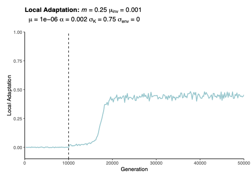
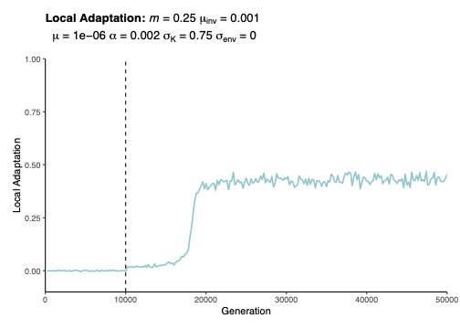
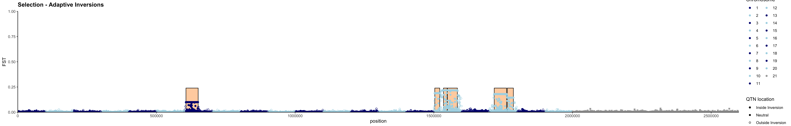
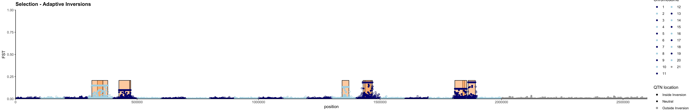
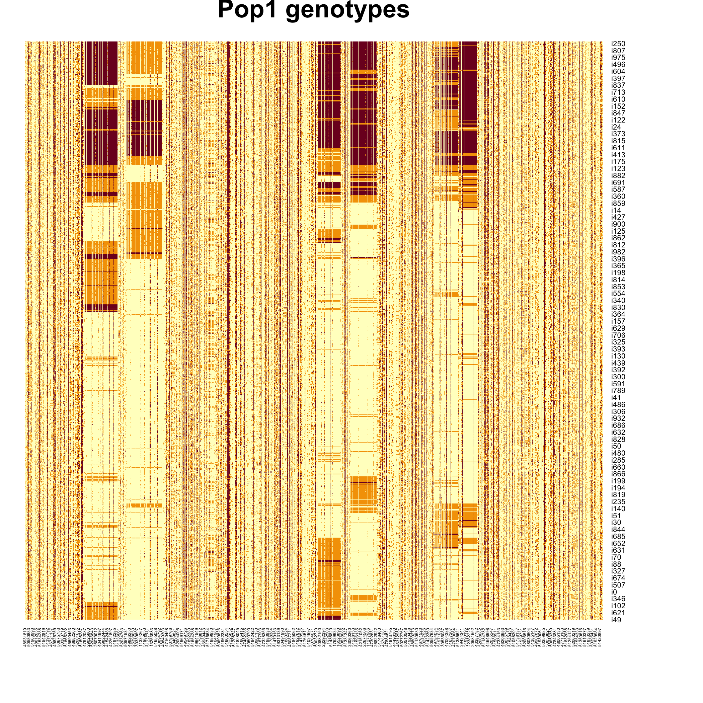
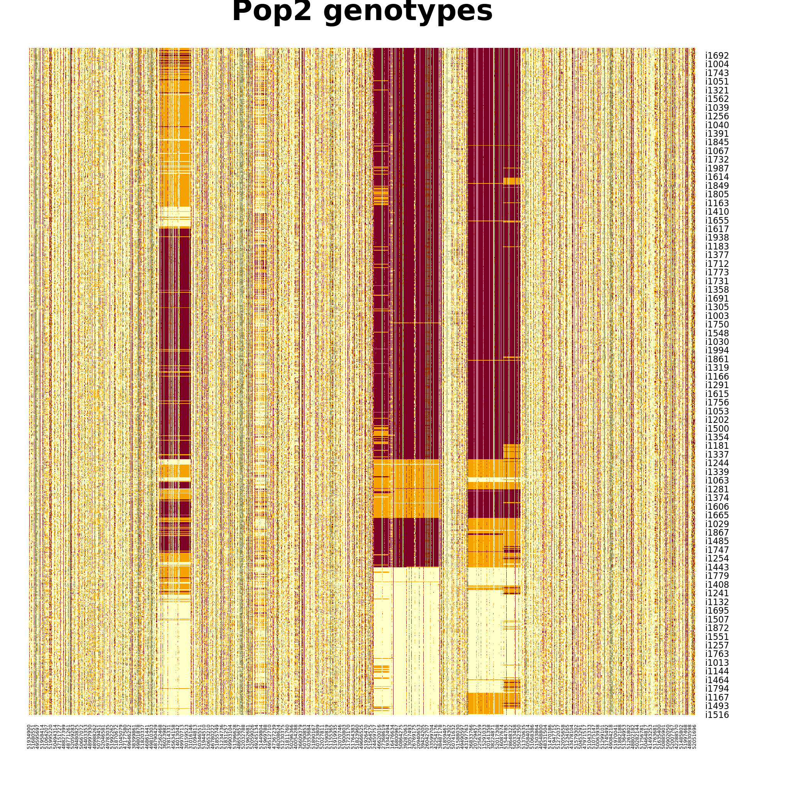
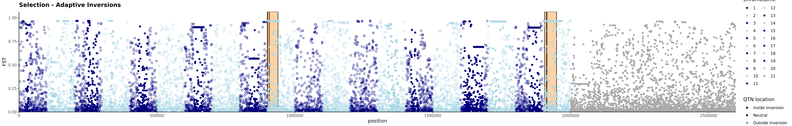
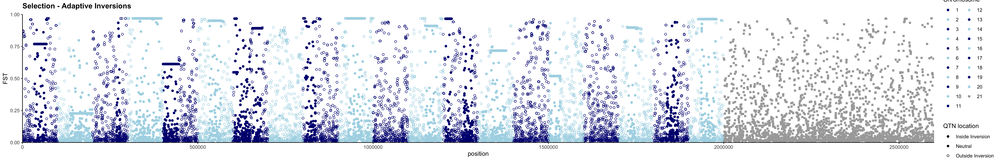

# Updates to Inversion Recombination
After being made aware of a bug in how recombination occurs in inverted individuals, we had to change how we do the recombination callback. Here is a link to the long discussion with explanations of the code: https://github.com/MesserLab/SLiM/issues/203 .   

We ended up not following these suggested updates to a T because of the number of inversions in our simulations and their ability to overlap. The main alteration is that we do not flip the breakpoint to the other side of the inversion when 1) the individual is homozygous inverted, 2) has an odd number of breakpoints in the middle, and 3) has drawn an additional breakpoint either at the start or end + 1 of the inversion. Instead we move that breakpoint to either the start - 2 if it was drawn at the start position of the inversion or end + 3 if drawn at the end + 1 position of the inversion. When we do this, we still have an odd number of breakpoints inside the inversion so we also add a breakpoint to the start and the end + 1 to create correct inheritance of the inversion. We argue this will have very limited implications to the results of our code because the chances of an odd number of breakpoints inside inversions + one at exactly the start or end + 1 is quite small for our inversion sizes and recombination rate.  

### Below is the code I implemented in SLiM:

```
recombination() {
	
	g1_invs = genome1.mutationsOfType(m3);
	g2_invs = genome2.mutationsOfType(m3);
	unshared_invs = setSymmetricDifference(g1_invs, g2_invs); // all heterozygous loci
	shared_invs = setIntersection(g1_invs, g2_invs); // all homozogyous loci
	
	if(size(unshared_invs) == 0 & size(shared_invs) == 0){// if no het and no hom inv
		removed_any = F;
	}

	
	if(size(shared_invs)){
		removed_any = NULL;
		for (invS in shared_invs) {
			start = invS.position;
	 		end = start + invS.tag;
			inInv = (breakpoints > start) & (breakpoints <= end);
			left = (breakpoints == start); // vector of T or F
      	right = (breakpoints == end + 1); // vector of T or F lenght of inside inversion breakpoints
			if(sum(inInv) % 2 == 0){
				removed_any = c(removed_any, F);			
			} else{
				if(sum(left) > 0 & sum(right) > 0){ 
					breakpoints = sort(c(breakpoints[!(left | right)]));
				} else if(sum(left) > 0 | sum(right) > 0){	
					breakpoints = sort(c(breakpoints[!(left | right)], 
								c(start, end + 1),
								c(start-2, end + 3)[c(sum(left)>0,sum(right)>0)]));
				} else if(sum(c(left,right)) == 0){
					breakpoints = sort(c(breakpoints, c(start, end + 1)));
				}
				removed_any = c(removed_any, T);			
			}	
		}
	}
	
	if(size(unshared_invs)){
		if(size(shared_invs)==0){
			removed_any = NULL;
		}
		for (invU in unshared_invs){
		
			startU = invU.position;
			endU = startU + invU.tag;
		
			inInv = (breakpoints > startU) & (breakpoints <= endU);
			if (any(inInv)){
			
				// *****finds any breakpoints that were made during the recombination step that fall within
				// the inversion and removes them*********
				breakpoints = breakpoints[!inInv];
				removed_any = c(removed_any, T);
			} else {
				removed_any = c(removed_any, F);
			}
		}
	}

	if(sum(removed_any) > 0){
		return T;
	}else{
		return F;
	}
	
}

``` 


### Eidos script for testing code
```
breakpoints = c(6, 15, 17, 51);
start_inv = c(2, 15, 32);
end_inv = c(5, 21, 37);
	if(size(start_inv)){
		removed_any = NULL;
		for (invS in 0:(length(start_inv)-1)) {
			//start = invS.position;
	 		//end = start + invS.tag;
	 		inv_start = start_inv[invS];
	 		inv_end = end_inv[invS];
			inInv = (breakpoints > inv_start) & (breakpoints <= inv_end);
			left = (breakpoints == inv_start); 
      	right = (breakpoints == inv_end + 1);	
			if(sum(inInv) % 2 == 0){
				removed_any = c(removed_any, F);		
			} else {
				if(sum(left) > 0 & sum(right) > 0){ 
					breakpoints = sort(c(breakpoints[!(left | right)]));
				} else if(sum(left) > 0 | sum(right) > 0){	
					breakpoints = sort(c(breakpoints[!(left | right)], c(inv_start, inv_end + 1),
										c(inv_start-2, inv_end + 3)[c(sum(left)>0,sum(right)>0)]));
				} else if(sum(c(left,right)) == 0){
					breakpoints = sort(c(breakpoints, c(inv_start, inv_end + 1)));
				}
				removed_any = c(removed_any, T);
			}
			
		}
		
	}
	
	
	Ustart = c(1, 9);
	Uend = c(4, 15);
	if(size(Ustart)){
		for (invU in 0:(length(Ustart) - 1)){
		
			// define the start and end position of the inversion
			start = Ustart[invU];
			end = Uend[invU];
		
			// the positions of proposed breakpoints are supplied to the callback by SLiM in the "breakpoints" variable
			// This variable is generated when recombination occurs and can be overwritten as we do below
			inInv = (breakpoints > start) & (breakpoints <= end);
			if (any(inInv)){
			
				// *****finds any breakpoints that were made during the recombination step that fall within
				// the inversion and removes them*********
				breakpoints = breakpoints[!inInv];
				removed_any = c(removed_any, T);
			} else {
				removed_any = c(removed_any, F);
			}
			
		}
		
	}
	
if(sum(removed_any) > 0){
	return T;
}else{
	return F;
} 

```

### An initial new result:  
 Final LA for old code was **0.449**, final LA for new code is **0.455**.

Local adaptation in original code compared to new code:  



Manhattan plot in original code compared to new code:  




All plots look very similar between old and new simulations. Even heatmaps appear similar with old on the left and new on the right for pop 1 and pop 2: 

  


  



One simulation that had adaptative inversions previously no longer does. But this is a red diamond case because there is so much genome wide divergence that inversions aren't facilitating the adaptation:



